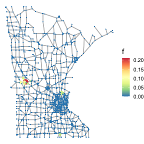

Data-driven Thresholding in Denoising with Spectral Graph Wavelet Transform
===========================================================================

The codes in this repository implement an efficient generalization of
the Stein’s Unbiased Risk Estimate (SURE) for signal
denoising/regression on graphs using Spectral Graph Wavelet Transform
Hammond, Vandergheynst, and Gribonval (2011). In particular, they allow
to reproduce the simulations presented in de Loynes, Navarro, and
Olivier (2021).

Installation
------------

The codes are based on the
[gasper](https://github.com/fabnavarro/gasper) package De Loynes,
Navarro, and Olivier (2020). To install the package, download the latest
[version](https://github.com/fabnavarro/gasper/releases) and run the
following command in a terminal:

``` bash
R CMD INSTALL --build gasper_1.0.0.tar.gz
```

Another possibility is to install the development version:

``` r
devtools::install_github("fabnavarro/gasper")
```

or the CRAN version:

``` r
install.packages("gasper")
```

The package and code execution require the installation of the following
external libraries:

``` r
package_list <- c("scatterplot3d",
                  "Rcpp",
                  "RcppArmadillo",
                  "igraph",
                  "genlasso",
                  "ggplot2",
                  "foreach",
                  "doMC",
                  "gridExtra",
                  "RColorBrewer",
                  "xtable",
                  "rwavelet",
                  "dplyr",
                  "tidyverse",
                  "sf",
                  "R.matlab")
```

Install missing packages:

``` r
isinstall <- sapply(package_list, 
                    function(x) x %in% rownames(installed.packages()))
package_list[isinstall]
sapply(package_list[!isinstall], install.packages)
```

For `figure_pitt.R`, the package `sf` is required. This package depends
on some dev libraries from your distribution (`libgdal-dev` and
`libudunits2-dev` for Ubuntu 18.04).

The matlab scripts are thoses provided by the authors of Wang et al.
(2016) and satisfy the same dependencies.

All the data files associated with the noisy realizations of the signals
considered for the various graphs as well as the results of the
simulations are contained in the folders with the names of the
considered graphs.

Reproduction of figures and tables
----------------------------------

Below, all the information are gathered to reproduce the numerical
results presented in the paper.

### Note

The comparisons made with graph trend filtering (GTF) involves the
matlab and python codes available on the webpage of one of the authors
(i.e. via this
[url](https://sites.cs.ucsb.edu/~yuxiangw/resources.html),
[gtf\_code.zip](https://sites.cs.ucsb.edu/~yuxiangw/codes/gtf_code.zip)
and
[code-to-run-wavelets.zip](https://sites.cs.ucsb.edu/~yuxiangw/codes/code-to-run-wavelets.zip)).

For *k* = 0, the R `genlasso` package was also used. In particular, for
the simulations corresponding to the Pittsbug graph using the data of
Wang et al. (2016) as well as Figure 4. The major difference between the
R package and the matlab code lies in the algorithm for solving the
underlying optimization problem. Indeed, the matlab code is based on the
methodology and C++ code developed in Chambolle and Darbon (2009) and
therefore is much faster than the R package.

Since the calculations can be long (e.g. several days for the numerical
experiments performed for the facebook graph for *k* &gt; 0), the
results have been stored in `.mat` files and the scripts to regenerate
them are also provided.

### The Minnesota Roads Graph

Load `figure_minnesota.R` to reproduce Figure 1.

``` r
source("figure_minnesota.R")
```



The results (associated with our methodology) presented in the table 1
have been stored in the files `res001A2MC10.Rdata` and
`res0001A4MC10.Rdata`. The table can be regenerated by running the
script `res2LaTeXtable.R`

``` r
source("res2LaTeXtable.R")
#> % latex table generated in R 3.5.2 by xtable 1.8-3 package
#> % Mon Jan  4 17:14:15 2021
#> \begin{table}[ht]
#> \centering
#> \begin{tabular}{rlll}
#>   \hline
#>  & A1 & A2 & A3 \\ 
#>   \hline
#> 1 & 16.07+-0.13 & 10.05+-0.13 & 4.03+-0.13 \\ 
#>   2 & 19.04+-0.24 & 14.22+-0.26 & 9.46+-0.26 \\ 
#>   3 & 20.07+-0.24 & 15.6+-0.3 & 10.69+-0.3 \\ 
#>   4 & 18.96+-0.27 & 14.16+-0.29 & 9.46+-0.26 \\ 
#>   5 & 20.04+-0.37 & 15.49+-0.43 & 10.64+-0.32 \\ 
#>   6 & 19.1+-0.24 & 14.28+-0.27 & 9.58+-0.27 \\ 
#>   7 & 20.08+-0.24 & 15.61+-0.29 & 10.72+-0.3 \\ 
#>   8 & 19.1+-0.24 & 14.26+-0.26 & 9.48+-0.24 \\ 
#>   9 & 20.01+-0.31 & 15.51+-0.36 & 10.61+-0.39 \\ 
#>   10 & 17.02+-0.12 & 11.89+-0.13 & 7.45+-0.15 \\ 
#>   11 & 17.05+-0 & 11.9+-0 & 7.44+-0 \\ 
#>    \hline
#> \end{tabular}
#> \end{table}
```

The realizations are stored in the three
`table_minesota_f*_sig*.mat*.mat` files (one file per noise
level/signal). The results corresponding to trend filtering
(*k* = 0, 1, 2) appearing in the table 1 are obtained by running the
script `table_minesota_trend.m`.

The set of values that the regularization parameter can take is the same
length as the one used for our methodology (i.e. the number of nodes in
the graph). It allows to avoid the need to manually calibrate the bounds
and the grid step for the GTF.

In addition, computations for our methodology can be run from the files
`table_minnesota_nonp.R`.

``` r
source("table_minnesota_nonp.R")
```

A parallel version is also available in `table_minnesota.R` (with `DoMC`
to be tuned according to your hardware). Though, this version can not be
run in GUI mode!

### The Facebook Graph

Run `facebook_randWalkPoisson.m` to reproduce Figure 2. The results
associated with the level dependent SGWT can be regenerated by executing
the script `facebookR.R`. Those for the trend part by executing
`facebook_randWalk.m`, `facebook_poisson_sparse.m` and
`facebook_poisson_dense.m` (they are extracted from the sources and
require the matlab toolbox mentioned in the Note). The execution of each
script takes between 3 to 4 days on a standard laptop. Note also that,
for the calibration of the trend regularization parameter, an exhaustive
search on a set of values similar in lenth to the set used with the
Donoho trick for our methodology (i.e. 4039) is not feasible here. The
boundaries and the number of grid points correspond to those present in
the original matlab code file provided by the authors of Wang et al.
(2016).

Figure 3 can be regenerated by running the script `facebookb2.m`.

### The Pittsburgh Census Tract Graph

Load `figure_pitt.R` to reproduce the figure of the Pittsburgh graph.

``` r
source("figure_pitt.R")
#> [1] "Input SNR_in=1.97dB"
#> [1] "Oracle Trend filtering SNR=7.17dB (25.5s)"
#> [1] "Oracle SGWT beta=2 SNR=9.75dB (1.22s)"
```


Comparison results using the data from the “Graph Trend Filtering” paper
example are reproducible by running the `pitt_f_y_formGTF.R` file. The
`pittsburgh.mat` file (containing *f* and *y*) comes from the code
associated with the GTF paper and was downloaded here
<a href="https://sites.cs.ucsb.edu/~yuxiangw/resources.html" class="uri">https://sites.cs.ucsb.edu/~yuxiangw/resources.html</a>
(i.e. `gft_code` folder here
<a href="https://sites.cs.ucsb.edu/~yuxiangw/codes/gtf_code.zip" class="uri">https://sites.cs.ucsb.edu/~yuxiangw/codes/gtf_code.zip</a>),
then stored in the `pittsburgh.rda` file. The adjacency matrix
associated with the Pittsburgh graph was obtained from the
`Exp_10copies_several_wavelets.m` script accessible via the same url.

``` r
source("pitt_f_y_formGTF.R")
```

For this example and the figure of the Pittsburgh graph, we have added a
comparison of calculation times between the two methods (although this
was not mentioned in the article). For one run our approach requires
less than 1 second (on a standard laptop, Intel Core
<a href="mailto:i7@2.7GHz-16Go" class="email">i7@2.7GHz-16Go</a>
<a href="mailto:LP-DDR3@2133MHz" class="email">LP-DDR3@2133MHz</a>) and
the fused lasso (with a default maximum iteration number of 2000) about
20. For the ten runs, our approach requires less than 2 seconds and the
fused lasso about 4 minutes. For our approach most of the computation
time is driven by the diagonalization and construction of the frame, but
these only need to be computed once. The evaluation of the SURE
afterwards is very fast. For the fused lasso, when the number of
iterations has to be increased (to ensure convergence), calculation
times may increase considerably. Note that the use of the C++ provided
by Chambolle and Darbon (2009) makes it possible to compensate for this
computational cost for trend filtering with *k* = 0. Therefore, in order
to facilitate the execution of `table_minnesota.R` and `table_pitt.R` we
have parallelized the code.

The results (associated with our methodology) in table 2 have been
stored in the file `resPitt.Rdata`, the table can be regenerated by
running the script `res2LaTeXtable.R` (uncomment the line corresponding
to the file path).

``` r
source("res2LateXtable.R")
```

The corresponding realizations are stored in the three
`table_pitt_sig*.mat` files (one file per noise level). The results for
the trend filtering (*k* = 0, 1, 2) as well as two other wavelet
estimators of Sharpnack, Singh, and Krishnamurthy (2013) appearing in
the table 1 are obtained by running the script `table_pitt_trend.m`. For
comparison, this script also provides the two other wavelet approaches
considered in Wang et al. (2016).

In addition, calculations (associated with our methodology) can be
re-run from the files `table_pitt.R`.

``` r
source("table_pitt.R")
```

### Real Dataset: New York City Taxis

The results presented in section Real Dataset: New York City Taxis are
reproducible by executing the script `nyc.R`.

``` r
source("nyc.R")
```

### Correlated Noise

The results presented in section Correlated Noise correlated noise are
reproducible by running the script `colored.R`.

``` r
source("colored.R")
```

### Further Experiments with Block Thresholding

The tests performed for the block method are in the script
`blockPitt.R`.

``` r
source("blockPitt.R")
```

References
==========

Chambolle, Antonin, and Jérôme Darbon. 2009. “On Total Variation
Minimization and Surface Evolution Using Parametric Maximum Flows.”
*International Journal of Computer Vision* 84 (3): 288.

de Loynes, Basile, Fabien Navarro, and Baptiste Olivier. 2021.
“Data-Driven Thresholding in Denoising with Spectral Graph Wavelet
Transform.” *Journal of Computational and Applied Mathematics* 389:
113319. <https://doi.org/https://doi.org/10.1016/j.cam.2020.113319>.

De Loynes, Basile, Fabien Navarro, and Baptiste Olivier. 2020. *Gasper:
GrAph Signal Processing in R*. *arXiv Preprint arXiv:2007.10642*.

Hammond, David K, Pierre Vandergheynst, and Rémi Gribonval. 2011.
“Wavelets on Graphs via Spectral Graph Theory.” *Applied and
Computational Harmonic Analysis* 30 (2): 129–50.

Sharpnack, James, Aarti Singh, and Akshay Krishnamurthy. 2013.
“Detecting Activations over Graphs Using Spanning Tree Wavelet Bases.”
In *Artificial Intelligence and Statistics (Aistats-13)*, 536–44.

Wang, Yu-Xiang, James Sharpnack, Alexander J. Smola, and Ryan J.
Tibshirani. 2016. “Trend Filtering on Graphs.” *J. Mach. Learn. Res.*
17: Paper No. 105, 41.
